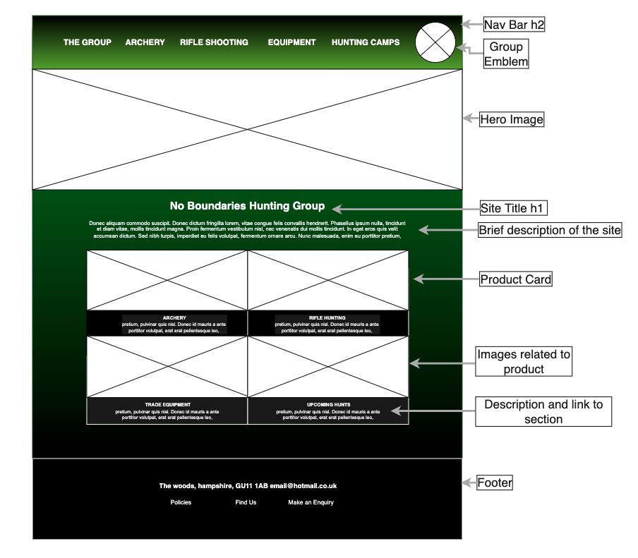

<h1> HTML - Make Something Lab </h1>

<h2>No Boundaries Hunting Group Webpage</h2>

  - At the top of the page I would like to include a Nav Bar within the **Header**, for each navigation item there will be a drop down list of pages related to that item.

 - The group's emblem will be displayed on the right within the Nav Bar.
 -  There will be a hero image of a hunting/archery related scene within the **Main Body**.
 -  Centred below the hero image will be the web site's main title with a synopsis.
 -  I will have four product cards representing the four main pages/sections of the website.
 -  Each card will contain:
  An image relating to that section.
  A brief description of what the User can expect from that section.
- The **Footer** will simply hold the address and email followed by links to a policies page, a 'how to find us' page and a form where the user can send enquiries to the administrator.

<h3> The wireframe for the proposed webpage </h3>

